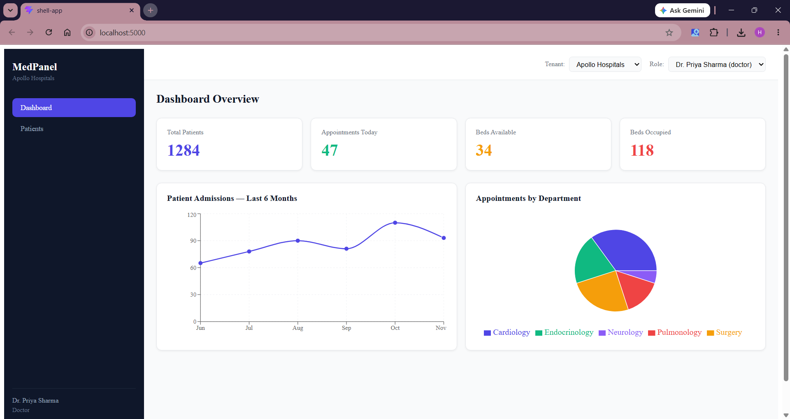

# MedPanel — Multi-tenant Healthcare SaaS Admin Panel

A production-grade micro-frontend application built to demonstrate enterprise React architecture patterns. MedPanel simulates a real-world B2B SaaS platform where multiple hospitals (tenants) manage patients and appointments through a shared platform with role-based access control.



---

## Architecture

MedPanel is built using **Micro-Frontend Architecture** with Webpack Module Federation. The application is split into four independently deployable units:

```
shell-app (port 5000)          — Host application, routing, layout
mfe-dashboard (port 5001)      — Analytics, KPI cards, charts
mfe-patients (port 5002)       — Patient records, search, detail view
mfe-appointments (port 5003)   — Appointment management, status updates
shared-lib                     — Shared types, components, contexts
```

Each MFE is a standalone React application that can be developed, tested, and deployed independently. The shell loads them at runtime via Module Federation — if one MFE is down, only that section of the app is affected.

---

## Key Technical Decisions

**Why Micro-Frontend Architecture?**
MedPanel mirrors the architecture used by large healthcare SaaS platforms where separate teams own separate product areas. Module Federation allows true runtime composition without shared build pipelines.

**Why TypeScript throughout?**
Shared types defined in `shared-lib` act as a contract between MFEs. If a `Patient` interface changes, TypeScript immediately surfaces every affected component across all four apps before runtime.

**Why static mock data over MSW in production builds?**
Mock Service Worker only runs in dev mode. For preview/production builds, mock data is imported directly — this keeps the demo fully functional without a backend while keeping the data-fetching pattern (React Query) identical to what a real API integration would look like.

**Why React Query over Redux for server state?**
Redux requires significant boilerplate for async data. React Query handles caching, background refetching, and optimistic updates out of the box. The appointments MFE demonstrates optimistic updates — status changes reflect instantly in the UI before the API confirms.

---

## Tech Stack

| Technology                     | Purpose                              |
| ------------------------------ | ------------------------------------ |
| React 18 + TypeScript          | UI and type safety                   |
| Vite + Module Federation       | MFE bundling and runtime composition |
| React Query (TanStack)         | Server state management              |
| React Router v6                | Client-side routing in shell         |
| Recharts                       | Dashboard data visualisation         |
| Vitest + React Testing Library | Unit and integration testing         |
| GitHub Actions                 | CI/CD pipeline                       |

---

## Features

**Multi-tenancy**
Switch between Apollo Hospitals and Fortis Healthcare tenants using the top bar selector. Each tenant has isolated data.

**Role-based Access Control**
Three roles with different permissions:

- **Admin** — full access to all sections
- **Doctor** — dashboard and patients only
- **Receptionist** — dashboard, patients, and appointments

Switch roles using the top bar selector to see navigation update in real time.

**Patient Management**

- Search patients by name or condition
- Filter by gender
- View full patient detail with one click

**Appointment Management**

- Filter appointments by status (scheduled / completed / cancelled)
- Update appointment status with optimistic UI updates
- Status cycles: Scheduled → Completed → Cancelled → Scheduled

---

## Running Locally

**Prerequisites:** Node.js 22+

```bash
# Clone the repository
git clone https://github.com/YOUR_USERNAME/medpanel.git
cd medpanel

# Build shared-lib first (required by all MFEs)
cd shared-lib && npm install && npm run build && cd ..

# Install dependencies for all apps
cd mfe-dashboard && npm install && cd ..
cd mfe-patients && npm install && cd ..
cd mfe-appointments && npm install && cd ..
cd shell-app && npm install && cd ..
```

Then open **4 terminals**:

```bash
# Terminal 1
cd mfe-dashboard && npm run build && npm run preview

# Terminal 2
cd mfe-patients && npm run build && npm run preview

# Terminal 3
cd mfe-appointments && npm run build && npm run preview

# Terminal 4 — open this last
cd shell-app && npm run dev
```

Open [http://localhost:5000](http://localhost:5000)

---

## Running Tests

```bash
cd mfe-patients
npm run test:run
```

---

## CI/CD

GitHub Actions pipeline runs on every push to `main`:

- Builds `shared-lib` and uploads `dist` as a pipeline artifact
- Runs all Vitest tests against `mfe-patients`
- Builds all four apps in parallel using a matrix strategy

---

## Project Structure

```
medpanel/
├── shared-lib/                 # Shared types, components, contexts
│   └── src/
│       ├── components/         # Button, Card, Badge
│       ├── context/            # TenantContext, AuthContext
│       └── types/              # TypeScript interfaces
├── mfe-dashboard/              # Analytics MFE (port 5001)
├── mfe-patients/               # Patient management MFE (port 5002)
│   └── src/test/               # Vitest + RTL tests
├── mfe-appointments/           # Appointment management MFE (port 5003)
└── shell-app/                  # Host shell (port 5000)
    └── .github/workflows/      # GitHub Actions CI
```
